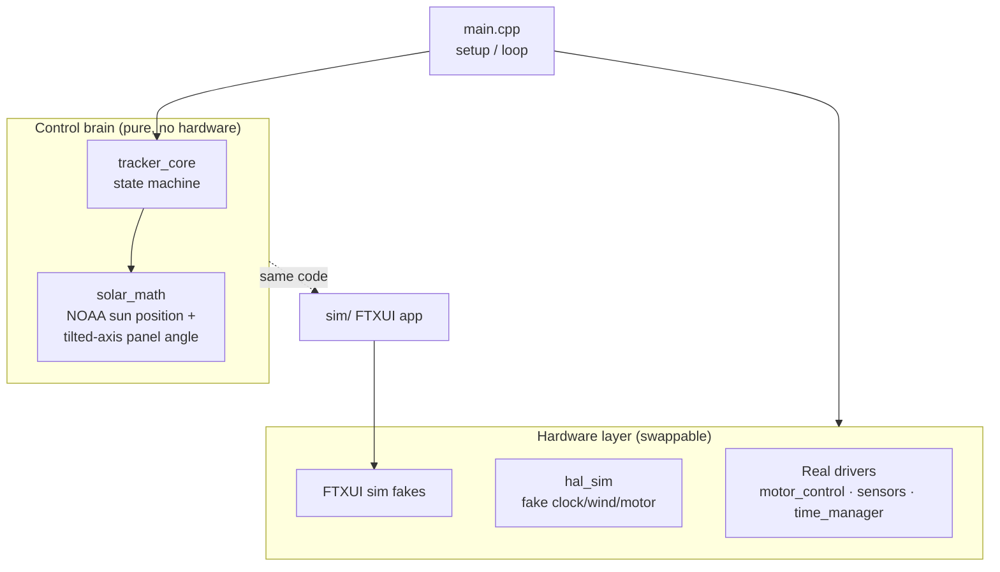
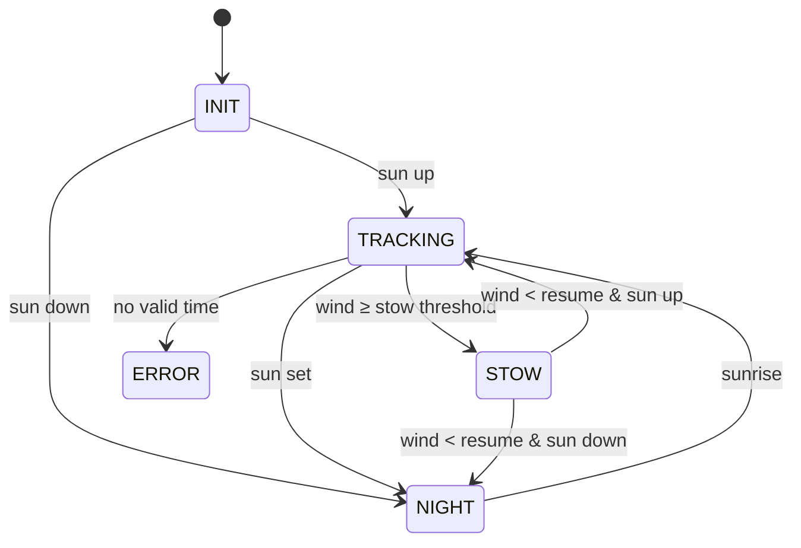

# Architecture

## Design idea
The firmware is built in **layers** so the control logic doesn't know or care what
hardware it's talking to. That's what lets the exact same decision code run on the
ESP32, in the native simulation, and in the interactive simulator.

The **brain** (`lib/tracker_core` + `lib/solar_math`) is pure C++ with no Arduino
dependencies. The **hardware layer** is chosen at build time, so the brain is
reused unchanged everywhere.

## Modules
| Module | Location | Responsibility | Hardware? |
|--------|----------|----------------|-----------|
| `solar_math` | `lib/solar_math/` | Sun elevation/azimuth + panel target angle | No (pure) |
| `tracker_core` | `lib/tracker_core/` | State machine: decide state + target each step | No (pure) |
| `main` | `src/main.cpp` | Wire it together: read inputs → `core.step()` → drive motor → log | Yes |
| `motor_control` | `src/motor_control.*` | BTS7960 driver, potentiometer feedback, limit switches | Yes |
| `sensors` | `src/sensors.*` | Anemometer (analog), LDRs, limit switches | Yes |
| `time_manager` | `src/time_manager.*` | DS3231 RTC + WiFi/NTP (always UTC) | Yes |
| `diagnostics` | `src/diagnostics.*` | Boot self-check report | Yes |
| `hal_sim` | `src/hal_sim.*` | Fake hardware for the native auto-runner | Sim |
| `arduino_compat` | `lib/arduino_compat/` | Arduino/RTClib shims for native builds | Sim |
| `config.h` | `include/` | All pins, location, thresholds, roof angle | — |

## State machine
The heart of `tracker_core`. Every cycle it evaluates the current time, sun, and
wind and may change state:

| State | Behavior |
|-------|----------|
| `INIT` | Home the panel east, then pick TRACKING or NIGHT |
| `TRACKING` | Drive panel to the computed sun angle |
| `STOW` | High wind — hold flat until wind drops below the resume threshold |
| `NIGHT` | Sun below `SUN_MIN_ELEV_DEG` — park east, wait for sunrise |
| `ERROR` | No valid time source (RTC + NTP both failed) |

## Build targets
One codebase, five targets (see [usage.md](usage.md)):

| Env / build | Runs on | Purpose |
|-------------|---------|---------|
| `esp32dev` | ESP32 | Real firmware |
| `simulate` | Mac (native) | Auto-runs a full day at 120× with fake hardware |
| `simulate_hw` | ESP32 | Firmware with fake sensors (serial demo) |
| `bringup` | ESP32 | Validate each sensor individually |
| `native` | Mac | Unit tests (sun math, pin checks) |
| `sim/` (CMake) | Mac | Interactive FTXUI simulator |

## Why this split matters
- **Testable:** the sun math and state machine are pure, so they run in unit tests
  and a desktop simulator with no hardware.
- **Faithful sim:** the simulator links the *real* brain — it's not a re-implementation.
- **Safe to change:** swapping a sensor (e.g., the anemometer) touches only the
  hardware layer, not the control logic.
