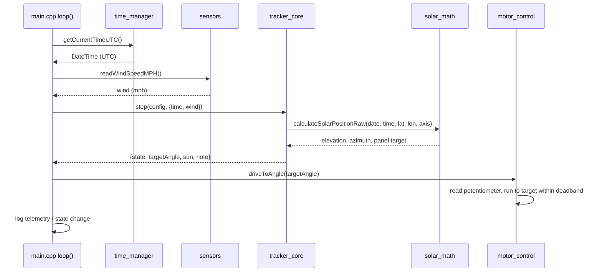

# Data Flow

## One control cycle
The firmware loop runs about once per second. Each cycle gathers inputs, asks the
brain for a decision, and acts on it.



## The pieces of data
| Data | Produced by | Consumed by |
|------|-------------|-------------|
| Current time (UTC) | `time_manager` (RTC/NTP) or `hal_sim` (fake clock) | `tracker_core` |
| Wind speed (mph) | `sensors` (anemometer) or fake | `tracker_core` (stow decision) |
| Sun elevation / azimuth | `solar_math` (from time + location) | `tracker_core`, telemetry |
| Panel **target** angle | `solar_math` (clamped to limits) | `motor_control` |
| Panel **actual** angle | `motor_control` (potentiometer) | `motor_control` feedback loop |
| State + transition note | `tracker_core` | logging / UI |

## Key principle: inputs in, decision out
`tracker_core::step()` is a **pure function of its inputs** — give it the same time,
wind, and config and it always returns the same decision. It never reads hardware
directly. That's why:
- the **firmware** feeds it real sensor data,
- the **native simulation** feeds it a fake clock and scripted wind,
- the **FTXUI simulator** feeds it whatever you set with the keyboard,

…and all three get identical tracking behavior.

## Time is always UTC
Every internal calculation uses **UTC**. The RTC stores UTC, NTP syncs UTC, and the
sun math takes UTC. Local time is only computed for display (`UTC + TIMEZONE_OFFSET`).
This avoids daylight-saving and timezone bugs in the tracking.

## Where the target angle comes from
```
date + time + latitude/longitude  ──► sun elevation & azimuth      (NOAA algorithm)
sun elevation & azimuth + axis tilt/azimuth ──► panel rotation angle (vector projection)
panel rotation angle ──► clamp to [PANEL_ANGLE_MIN, PANEL_ANGLE_MAX]
```
Full math in [sun_tracking_math.md](sun_tracking_math.md).
